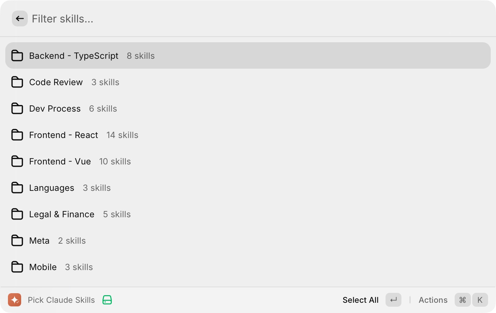
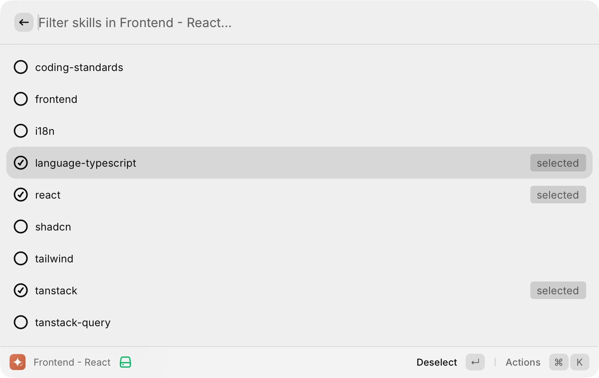
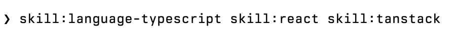

# Claude Skills Picker

A Raycast extension to find, organize, and paste [Claude Code](https://docs.anthropic.com/en/docs/claude-code) skills into your conversation.

## Why

Claude Code skills are powerful, but hard to use in practice. You have dozens of them in `~/.claude/skills/`, and during a conversation you need to remember their exact names to invoke them: `skill:react, skill:coding-standards, skill:language-typescript`.

Claude Code has a `/skill-name` command, but it only loads one skill at a time. For a React project you might need `react`, `coding-standards`, `language-typescript`, `tailwind`, `shadcn`, `testing` — and you have to remember which ones to load every time you start a conversation.

You forget which skills you have. You misspell names. You waste time scrolling through a flat directory.

This extension lets you browse your skills visually, organize them into categories, select what you need, and paste the result directly into your Claude Code conversation.





## Features

### Folder Navigation

Organize skills into custom categories. A skill can belong to multiple categories.

| Action | Shortcut | Description |
|--------|----------|-------------|
| Select/Deselect all in folder | `Enter` | Toggle all skills in a category |
| Open folder | `->` | Drill into a category |
| Go back | `<-` | Return to root (focus restored) |

### Skill Selection

Pick skills across folders. Selection persists as you navigate.

| Action | Shortcut | Description |
|--------|----------|-------------|
| Select/Deselect skill | `Enter` | Toggle individual skill |
| Paste selected | `Cmd + Enter` | Paste all selected as `skill:x, skill:y` |

### Search

Type to search across all skills, including those inside folders. Entering a folder from search clears the query; going back restores it.

### Category Management

| Action | Shortcut | Description |
|--------|----------|-------------|
| Edit categories | `Cmd + E` | Add/remove skill from categories |
| New category | `Cmd + N` | Create a new category (inside Edit Categories) |
| Rename category | `Cmd + R` | Rename an existing category |
| Delete category | `Cmd + D` | Remove a category (skills are not deleted) |

## Setup

```bash
git clone <repo-url> && cd raycast-skills
bun install
```

Import into Raycast:

```
open raycast://extensions/import?path=$(pwd)
```

## How Categories Work

Categories are stored in `~/.claude/skills/.categories.json`:

```json
{
  "Frontend - React": ["react", "tailwind", "shadcn", "ui-ux"],
  "Backend": ["database", "drizzle-orm", "security-defensive"],
  "Testing": ["testing", "e2e", "tdd"]
}
```

- A skill can appear in multiple categories
- Skills not in any category appear under "Uncategorized"
- Deleting a category does not delete the skills themselves
- The file is human-editable

## Tests

```bash
bun run test
```

## Stack

- [Raycast API](https://developers.raycast.com/) v1.93+
- React, TypeScript, [better-result](https://github.com/swan-io/boxed)
- [Vitest](https://vitest.dev/) for testing
